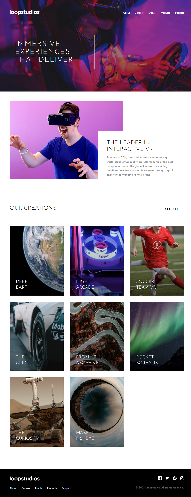

<!-- **<h1 align="center">On development 🚧 </h1>** -->
**<h1 align="center">Loopstudios landing page</h1>**

**<h2>Demo</h2>**

[View Demo](https://loop-studios-page.netlify.app/)

**<h2>Build with</h2>**

* html
* css
* javascript

**<h2>Screenshot</h2>**



**<h2>Setup the project</h2>**

  * Fork the project

  * Clone this project in the folder of your choice

    ```bash
    git clone https://github.com/Ryusse/loopstudios-landing-page-main.git
    ```

  * Install the dependencies

  * If you use npm 

    ```bash
    npm install
    ```

  * If you use yarn

    ```bash
    yarn install
    ```

  * Run the server

    ```bash
    npm run dev
    ```
